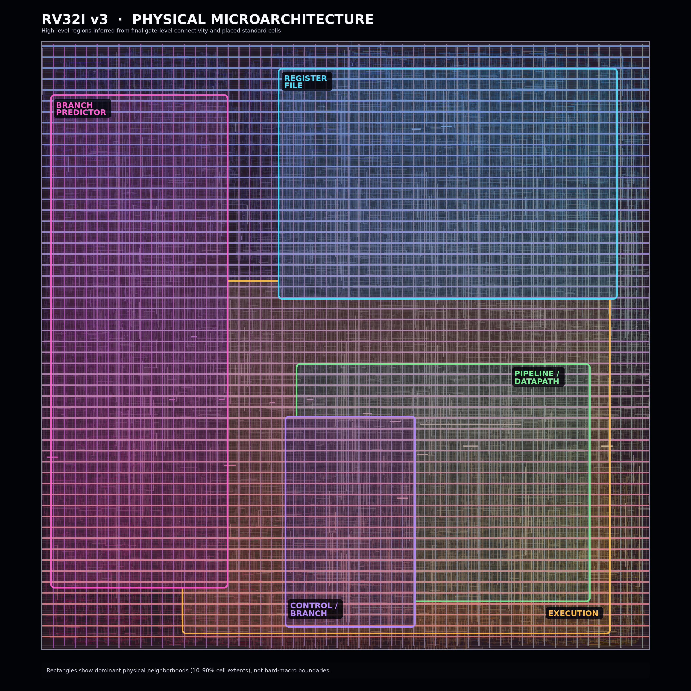
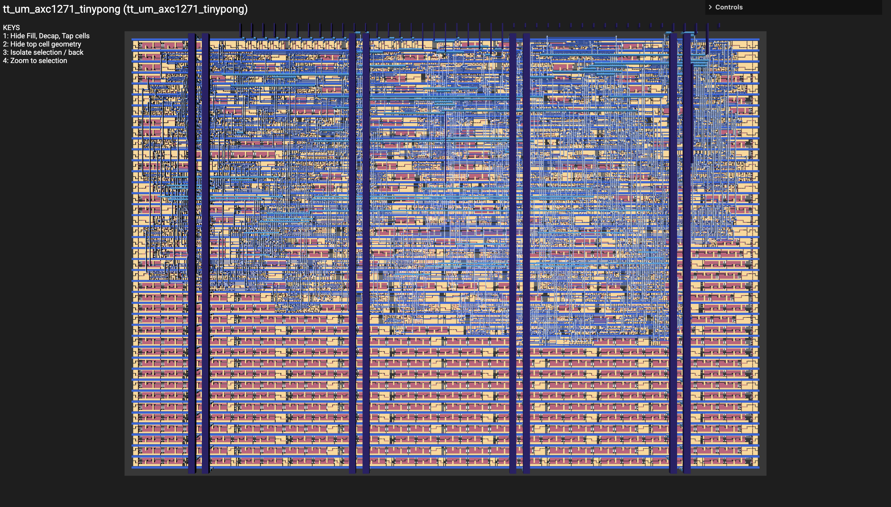
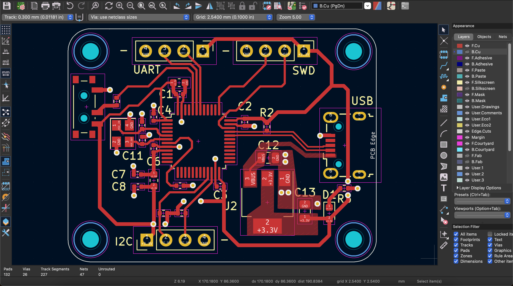

# Andrew Chen

**MS ECE @ Carnegie Mellon | Computer Architecture · RTL Design · ASIC/FPGA**

I build processors and digital hardware from microarchitecture through RTL, verification, and physical implementation.

Most of my work right now is around CPU microarchitecture: superscalar execution, branch prediction, out-of-order execution, caches, and memory systems. I’m also building an INT8 neural-network accelerator to explore architectures outside general-purpose CPUs.

Previously Design Lead @ [ASICWRU — CWRU CHIPS ASIC Design](https://asicwru.netlify.app).

## Featured Projects

### [RISC-V v4 — 2-Way Superscalar RV32IM OoO Processor](https://github.com/AxC1271/RISCV-v4) · In Progress

Building an out-of-order superscalar RISC-V processor to explore the bottlenecks that remain after widening an in-order machine.

Current work includes:

* Register renaming and physical register management
* Reservation stations / dynamic instruction scheduling
* Reorder-buffer-based in-order retirement
* Speculative execution and branch recovery
* Multi-level cache hierarchy and memory-system work
* Exploring cache coherence and more scalable SoC architecture
* RV32IM execution support

The goal is not just to make a wider processor, but to understand where instruction-level parallelism is actually lost and what hardware is required to recover it.

---

### [RISC-V v3 — 2-Way Superscalar RV32I](https://github.com/AxC1271/RISCV-v3)

2-way superscalar in-order processor built to explore instruction-level parallelism, branch prediction, and the physical cost of a wider machine.

* 2-wide fetch/dispatch with dual integer ALUs
* 4R/2W register file and multi-lane bypass forwarding
* RAW/WAW, load-use, branch, and structural hazard handling
* Instruction replay for unsupported issue combinations
* Always Not-Taken, 2-bit Bimodal, and GShare branch predictors
* ~**1.85 IPC** on independent-ALU workloads, approaching the theoretical 2.0 IPC limit
* ~**18% IPC improvement** on Matrix Multiply and ~**32%** on Bubble Sort versus my previous scalar core
* GShare reduced String Search branch mispredictions by ~**37%** compared with Bimodal
* Synthesized, placed, routed, and exported to GDS targeting SkyWater 130nm

  
  

The fully synthesized die is on the right, whereas the left image shows the general locations of the different components of the superscalar core using the `.def` and the `.odb` files.

---

### [mini-NPU — INT8 Systolic Accelerator](https://github.com/AxC1271/mini-NPU) · In Progress

Building an INT8 neural processing unit in SystemVerilog around a parameterized systolic MAC architecture.

Current work focuses on the INT8/INT32 processing element and the dataflow required to scale it into an **8×8 systolic array**.

The project is intended to explore:

* Array utilization and tiling
* Weight / activation data reuse
* Memory bandwidth pressure
* INT8 multiply-accumulate datapaths
* The difference between theoretical and sustained accelerator throughput

**Target:** 64 MACs/cycle · INT8 operands · INT32 accumulation · SkyWater 130nm

---

### [RISC-V v2 — 5-Stage Pipelined RV32I](https://github.com/AxC1271/RISCV-v2)

My previous scalar processor and the design that became the foundation for the later RISC-V projects.

* 5-stage IF / ID / EX / MEM / WB pipeline
* EX-stage branch resolution
* Dual forwarding paths and load-use hazard detection
* Direct-mapped I-cache and 2-way set-associative write-back D-cache
* FPGA implementation at **85 MHz**
* SkyWater 130nm synthesis / STA at **58.8 MHz**
* **0.64–0.76 IPC** across benchmark workloads

This project taught me most of the pipeline, cache, timing, and control infrastructure that I later reused and extended in v3.

## Earlier Hardware

### [CWRU CPU — RISC-V ASIC](https://github.com/john-paul-sm/ASICWRU_SimpleCounter)

Led an undergraduate ASIC design team through RTL development and tapeout of a small single-cycle RISC-V processor through Tiny Tapeout.

[View GDS →](https://gds-viewer.tinytapeout.com/?model=https://john-paul-sm.github.io/ASICWRU_SimpleCounter/tinytapeout.oas&pdk=gf180mcuD)

### [Tiny Pong — SkyWater 130nm](https://github.com/AxC1271/Tiny-Pong)

VGA Pong controller implemented in Verilog and taped out through Tiny Tapeout.

  

[View GDS →](https://axc1271.github.io/TinyPong/)

### [STM32 Development Board](https://github.com/AxC1271/STM32-DevBoard)

Custom STM32F103 development board designed in KiCad and fabricated at JLCPCB, with FPGA-based UART validation.

  

## Tools

**RTL / Architecture:** SystemVerilog · Verilog · VHDL · RISC-V Assembly  
**EDA:** Vivado · Yosys · OpenSTA · SymbiYosys · Icarus Verilog · KiCad  
**Software:** C · Python · Bash · Git · Linux · Docker

## Outside Hardware

Needle felting, poetry, music, baking, skateboarding, chess, reading, and handstand push-ups.
